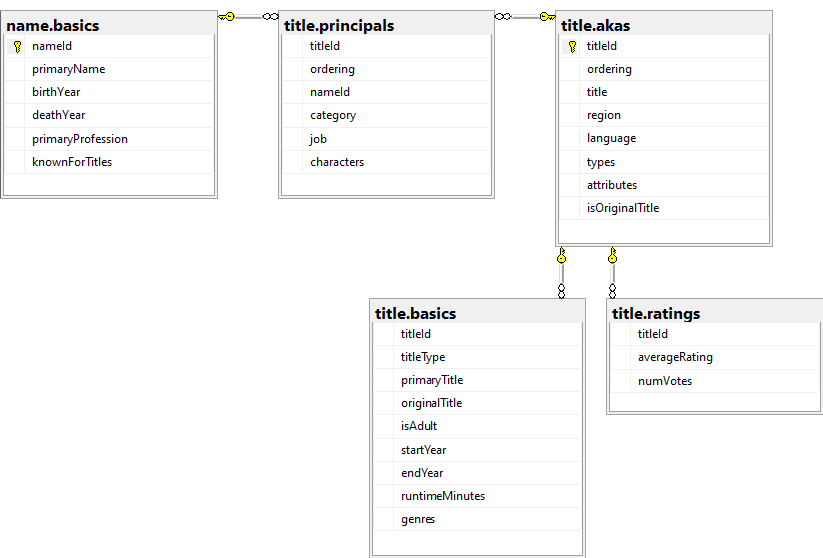

# Description of Moviebase

This  is a simple Python script which uses the IMDB dataset to get recommendations for movies and tv-shows based on titles and actors. When the script is run, the user is asked to choose between title(1) or actor(2), followed by a request to enter the name of the title or actor. To handle duplicate titles, the user is also asked to enter the year of publication. The user will then get a list of movies and tv-shows the chosen actor has been in, OR a list of tv-shows and movies with the same actors as the chosen title. The list is ordered by year of publication.

---

## Technology

The application is developed in VScode, using python along with the pyodbc module to help access the SQL database. The database server was set up through SQL Server 2022 Configuration Manager, and SQL Server Management Studio 20 was used for designing the database and importing the IMDB dataset. The IMDB dataset was downloaded from [this](https://developer.imdb.com/non-commercial-datasets/) address.

---

### Database diagram

As you can see, there are tables and rows which remains unused in the app at the moment. One could argue that this is bad practice, but I prefer to leave it there for now as i don't know what i will use later.

---

## Ideas for improvement

### Scaling functionality
The objective of this script is to demonstrate abilities to work with database manipulation scripts, and is somewhat limited in size and functionality although one can do so much more with this dataset. Maybe it will come later.

### Design and UX
This app is a purely consol-based experience, and i would like to create a user interface in the future, with panels and boxes instead of decision trees.
